---
tags:
  - articles/research
  - notes
url: https://arxiv.org/abs/2310.10822
code: false
---

> [!help] Resources 
> 📄 **Article**
> [[bs-thesis/articles/Online-Vision-Language-Mapping.pdf|Xu et. al., Vision and Language Navigation in the Real World via Online Visual Language Mapping]]

> [!quote] Abstract
> Navigating in ==unseen environments== is crucial for mobile robots. Enhancing them with the ability to follow instructions in ==natural language== will further improve navigation efficiency in unseen cases. However, state-of-the-art (SOTA) vision-and-language navigation (VLN) methods are mainly evaluated in *simulation*, neglecting the complex and noisy real world. Directly transferring SOTA navigation policies trained in simulation to the real world is challenging due to the **visual domain gap** and the absence of **prior knowledge** about unseen environments. In this work, we propose a novel ==navigation framework== to address the VLN task in the real world. Utilizing the powerful **foundation models**, the proposed framework includes four key components:
> 1. An LLMs-based ==instruction parser== that converts the **language instruction** into a sequence of pre-**defined macro-action descriptions**.
> 2. An online ==visual-language mapper== that builds a **real-time visual-language map** to maintain a *spatial and semantic understanding* of the unseen environment.
> 3. A language ==indexing-based localizer== that grounds each **macro-action description into a waypoint location** on the map.
> 4. A ==[DD-PPO](https://arxiv.org/abs/1911.00357)-based local controller== that **predicts the action**. We evaluate the proposed pipeline on an Interbotix LoCoBot WX250 in an unseen lab environment. Without any fine-tuning, our pipeline significantly outperforms the SOTA VLN baseline in the real world.

> **DD-PPO (Decentralized Distributed Proximal Policy Optimization)**
> is a method for distributed reinforcement learning in resource-intensive simulated environments. DD-PPO is distributed (uses multiple machines), decentralized (lacks a centralized server), and synchronous (no computation is ever 'stale'), making it conceptually simple and easy to implement.
> 
> https://paperswithcode.com/method/dd-ppo

---

# Introduction

## Human Navigation Strategy for Robots

- Human navigation using maps (in brain 🧠) with
	- Spatial context :luc_maximize_2:
	- Visual context :luc_eye:
	- Semantic understanding :luc_message_circle:
- **Unfamiliar environments** :obs_right_arrow_with_tail: Language-based instructions necessary
- Robots with ability to **understand natural language instructions** for *unseen scenarios* are more useful.

## Challenges in Real-World Deployment

### Challenges

- Visual domain gap
- Absence of prior environment information

### Existing Solutions

- Extra sensor fusion (e.g. LiDAR)
- Domain randomization techniques
- Using LLMs and VLMs
	- **LLMs:** Parse instruction to landmarks or executable code.
	- **VLMs:** Process comples real-world information, ground language instructions.


> [!warning] Catch
> These methods require **prior mapping of the environment** which is not directly applicable for *Vision-Language Navigation for Continuous Environments* (VLN-CE).
> 
> **VLN-CE** - Vision-Language Navigation task in which the *robot cannot teleport* to the target pose.

## Proposed Solution

For VLN-CE, tackle by using powerful Foundation Models as explained in the figure below.

![[bs-thesis/assets/online-vlm__pipeline.png]]

### Approach

1. Use **LLM** to *ground the unstructured language instruction* by parsing the instructions into a ==sequence of pre-defined robot macro-action== descriptions. ^approach-1
2. Noisy and complex environment handled by build and ==*online* visual-language map== using a **VLM**. ^approach-2
3. With the latest map (from [[#^approach-2|2]]) and parsed macro-action description (from [[#^approach-1|1]]), a **language indexing-based localizer** maps each *action description* to a *waypoint location* on the map. ^approach-3
4. Treating this **waypoint** (from [[#^approach-3|3]]) as a point goal a DD-PPO policy is used to ==predict the next action==. ^approach-4


> [!info] Performance
> We conducted the experiments on an Interbotix LoCoBot WX250 in an unseen lab environment. In the examined instruction following tasks, without any fine-tuning, the proposed pipeline significantly outperforms the state-of-the-art VLN-CE baseline.

[[bs-thesis/articles/Online-Vision-Language-Mapping.pdf#page=1&selection=184,41,190,49|Online-Vision-Language-Mapping, page 1]]

# Problem Statement

## VLN-CE

- The robot has to take **primitive actions** (`move_forward()`, `turn()`, etc.) to navigate to the desired goal.
- Navigation is in physical space (SE(2)), following **natural language instructions**.
- Not discrete setting, where the robot selects a node from a pre-collected navigation graph.

## Setup

At the beginning of each episode,
- $\mathcal{L} = \textlangle{w_0, w_1, w_2, \dots, w_L}\textrangle$ is the **natural language instruction** as a *sequence of tokens*.
- $o_0$ is the initial **front-view observation**.
- $s_0 = \textlangle{x_0, y_0, \theta_0}\textrangle$ is the initial **pose** (position and heading) of the robot.

## Working

- At each **time step** $t$, the robot chooses an **action** $a_t$ from the set of *allowed actions* (pre-defined).
- After taking the action $a_t$, the robot moves to the new **pose** $s_{t + 1}$ and observes a new $o_{t + 1}$
- Following the instruction $\mathcal{L}$, the episode terminates when either of the following occur
	- *Timeout* reached
	- Robot chooses the `stop()` action.
- The ==goal== :luc_target: is to find the **sequence** of $\textlangle{s_0, a_0, o_0, s_1, a_1, o_1, \dots, s_T, o_t, a_t}\textrangle$ which **aligns with the language instruction** $\mathcal{L}$

# Method

## Instruction Parser

### Instruction Format

- Instructions in the VLN-CE task consist of several **sub-instructions** :ril_node_tree: 
- e.g. In the **Room-to-Room (R2R)** task, the robot is asked to move from one room to the adjacent room, following an instruction like, *"Exit the bedroom and turn left. Walk straight passing the gray couch and stop near the rug."*
- The entire instruction can be parsed into a set of sub-instructions :ril_node_tree: such as:
	1. *Exit the bedroom*
	2. *Turn left*
	3. *Walk straight past the gray couch*
	4. *Stop near the rug*
- Notice that each parsed sub-instruction describes either **a pure robot movement** 🤖 (e.g. *"turn left"*) or **a movement wrt an associated landmark** :obs_pin::ril_send_plane: (*"walk straight past the gray couch"*)

### Making the Robot Understand Instructions

> However, these parsed sub- instructions can not be directly executed by the robot.

[[bs-thesis/articles/Online-Vision-Language-Mapping.pdf#page=3&selection=153,27,154,55|Online-Vision-Language-Mapping, page 3]]

- Using the powerfule **textual-interpretation abilities of LLMs**, the instructions/sub-instructions are parsed and converted to a *sequence of pre-defined robot macro-actions descriptions*.
- The instructions are parsed to a python `dict` with the movement's name and associated parameters.
- [Few-shot prompt engineering](https://www.promptingguide.ai/techniques/fewshot) is used to parse each instruction before conducting the navigation experiments.

> [!info] Instruction Parsing Format
> The natural language **sub-instructions** are parsed into a python `dict` with the format
> 
> ```python
> >>> instruct = "Walk straight past the gray couch"
> >>> parse_instruct_to_dict(instruct)
> {"name": "move_to", "landmark": "gray couch"}
> ```

## Online Visual-Language Mapper

- *Can't collect data from target environments* because assumed to be **unseen**.
- Introduce **online mapper** which progressively builds a visual-language map of the unseen environment.

### Enhancing Occupancy Maps with Visual-Language Features

```mermaid
flowchart TB
	mapper[Mapper]
	cam[Camera 📷] -..-> img[Image 🖼️]
	instr[Instructions] --"LLM"--> dict[Dictionary]
	img --Visual--> mapper
	dict --Semantic--> mapper
	mapper --> grid[2D Occupancy Grid]
```



